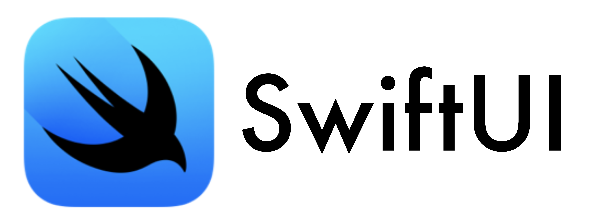

# SwiftUI学習サンプルアプリ
### 制作の意図
SwiftUIフレームワークの基礎文法、各機能の実装イメージを掴むための初歩として作った機能のサンプルです。

### 概要
**アニメーション**
* サンプル1---フェードイン
* サンプル2---回転
* サンプル4---大小
* サンプル5---バロメーターアップ
* サンプル6---円メーターアップ

**タイマー**
* サンプル1---ストップ/スタート
* サンプル3---円メーター/ストップ/スタート/リセット

# SwiftUI自作サンプルアプリ
### 制作の意図
自身の想像で作った、初歩機能のサンプルです。
* 練習1---画面遷移/@STATE
* 練習2---V/H/ZStack
* 練習3---画面遷移(モーダル)
* 練習4---リスト
* 練習5---if/else-if文
* 練習6---計算
* 練習7---@BINDING

# SwiftUI課題
### 制作の意図
UIKitで作られていたネット上のものを、SwiftUIに作り変えることを課題として、作成しました
* 課題01---演算
* 課題02---四則演算関数
* 課題03---トグル演算
* 課題04---加算
* 課題05---乗算
* 課題06---乱数/アラート
* 課題07---タブの切り替え
* 課題08---@STATE/BINDING
* 課題09---画面遷移(ナビゲーション)
* 課題10---リスト
* 課題11---配列/Switch文
* 課題12---税込計算
* 課題14---リスト項目の追加
* Demo-Listediting---永続化(UserDefaults)
